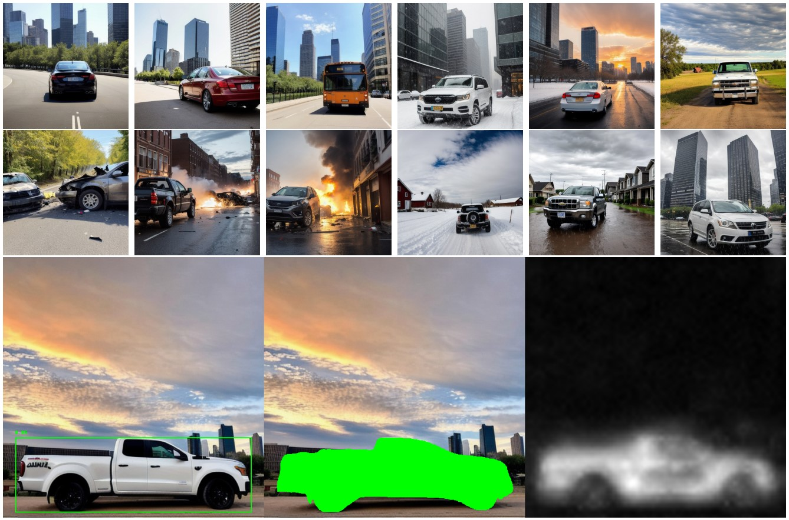
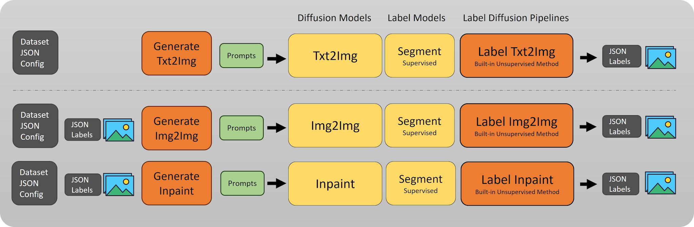

# DiffuGen: Adaptable Approach for Generating Labeled Image Datasets using Stable Diffusion Models

### [**Paper**](https://arxiv.org/pdf/2309.00248.pdf) | [**Website**](https://mshenoda.github.io/diffugen)

To address challenges associated with dataset generation, we introduce "DiffuGen," a simple and adaptable approach that harnesses the power of stable diffusion models to create labeled image datasets efficiently. By leveraging stable diffusion models, our approach not only ensures the quality of generated datasets but also provides a versatile solution for label generation. The methodology behind DiffuGen, combines the capabilities of diffusion models with two distinct labeling techniques: unsupervised and supervised. Distinctively, DiffuGen employs prompt templating for adaptable image generation and textual inversion to enhance diffusion model capabilities. 

<p align="center">

</p>

## Framework
DiffuGen provides a robust framework that integrates pre-trained stable diffusion models, the versatility of prompt templating, and a range of diffusion tasks. By using an input configuration JSON, users can specify parameters to generate image datasets using three primary stable diffusion tasks. Each of these tasks not only benefits from the prompt templating mechanism, ensuring adaptability and richness, but also comes with its dedicated integral labeling pipeline. This design allows DiffuGen to provide both supervised and unsupervised labeling methods tailored to the specific needs of each task, ensuring a well-aligned and efficient labeling process for diverse application needs.

<p align="center">

</p>

## Installation

### Clone
```
git clone https://github.com/mshenoda/diffugen.git
```

### Create environment 
```
cd diffugen
conda create -n diffugen python=3.11
conda activate diffugen
```

### Install requirements

### PyTorch with CUDA Dependency
```
pip3 install torch torchvision --index-url https://download.pytorch.org/whl/cu118
```
### other packages
```
pip3 install -r requirements.txt
```

## Structure
[**LabelDiffusion**](https://github.com/mshenoda/label-diffusion) is the core module of DiffuGen that provides labeling pipelines
```
├───datasets    # contains datasets configuration files
├───generate    # contain methods to generate dataset per pipeline
│   ├───txt2img.py          # Generates text-to-image dataset, uses LabelDiffusion
│   ├───img2img.py          # Generates image-to-image dataset, uses LabelDiffusionImg2Img
│   └───inpaint.py          # Generates inpainting dataset, uses LabelDiffusionInpaint
├───models
│   ├───sd
│   │   └───embeddings # textual inversion embeddings
│   └───seg            # segmentation models, currently YOLOv8-Seg
└───generate.py        # main python script to generates any of the txt2img, img2img, inpaint
```

## Generate Datasets

### Starting with Text-to-Image Pipeline
```
python generate.py txt2img datasets\cars.json
```

### Then Generate Dataset with Image-to-Image Pipeline
```
python generate.py img2img datasets\cars.json
```

### And/Or Generate Dataset Inpainting Pipeline
```
python generate.py inpaint datasets\cars.json
```


## Training Textual Inversion

Textual inversion is a training technique used in the context of stable diffusion models. It allows you to add new styles or objects to your text-to-image models without modifying the underlying model. 
This technique works by learning and updating the text embeddings to match the example images you provide.

General outline of training and using textual inversion:
- A new keyword representing the desired concept is defined with a place holder <keyword>.
- A new embedding vector for this specific word or token is initialized.
- A collection of images that represent the new style or object is provided.
- The new embedding vector is trained with these images to represent the desired concept in the embedding space.
- The trained embeddings are loaded into the existing model. The model itself is not retrained.
- The model generates images that aligns with the desired concept keyword using the new embeddings.

Training Textual Inversion Notebook: 
https://colab.research.google.com/github/huggingface/notebooks/blob/main/diffusers_doc/en/pytorch/text_inversion.ipynb

Guide by huggingface: 
https://huggingface.co/docs/diffusers/training/text_inversion

Textual Inversion Paper: 
https://textual-inversion.github.io/

## Citation
If you find DiffuGen useful for your research, please cite:
```
@inproceedings{diffugen,
  title     = {DiffuGen: Adaptable Approach for Generating Labeled Image Datasets using Stable Diffusion Models},
  author    = {Shenoda, Michael and Kim, Edward}
  year      = {2023}
}
```
